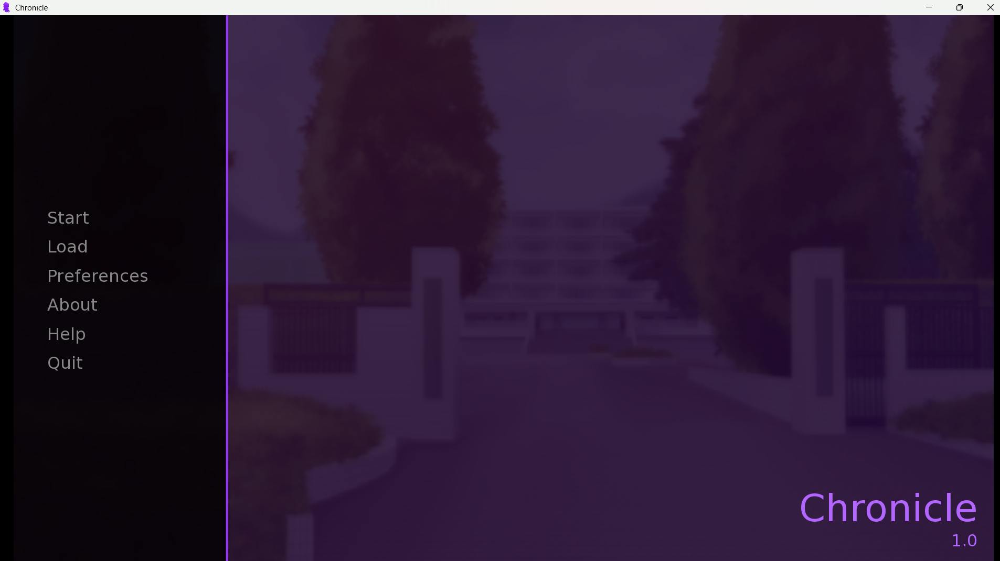
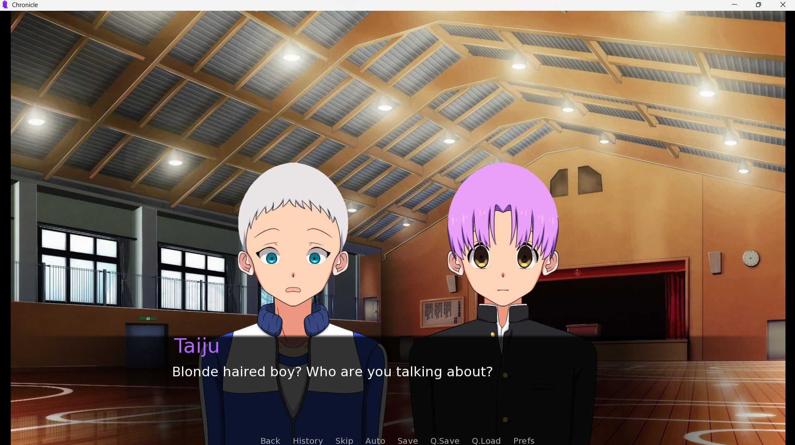

# Chronicle

Chronicle is a detective visual novel build using Ren'Py and python.The game starts with two students Taiju and Hikari walking on there way to school for the graduation ceremony.There they come to know the Academic award got stolen.The students correct choices would reveal the mystery.

**Estimated playtime:**30-60 minutes

---
## Features
- Detective storyline
- Multiple endings
- Multiple Suspects
- Short playtime
---
## Screenshots
|Investigation|Choices|
|-------------|-------|
|||
---
## Controls
|Key|Function|
|----|--------|
|Enter/Space bar/Right click|Next dialogue|
|Ctrl|Skip read text|
|Esc|Open main menu|
|A|Auto mode|
|H|Hide dialogue|
---
## Download
you can download the game from Itch.io:

https://muinashraf.itch.io/the-chronicle
---
## Credits
- Background Scenes: Noraneko games
- Assests:Itch.io creators
- Music: Pixabay
- Character Sprites: Tainara
---
## License
[MIT](LICENSE)