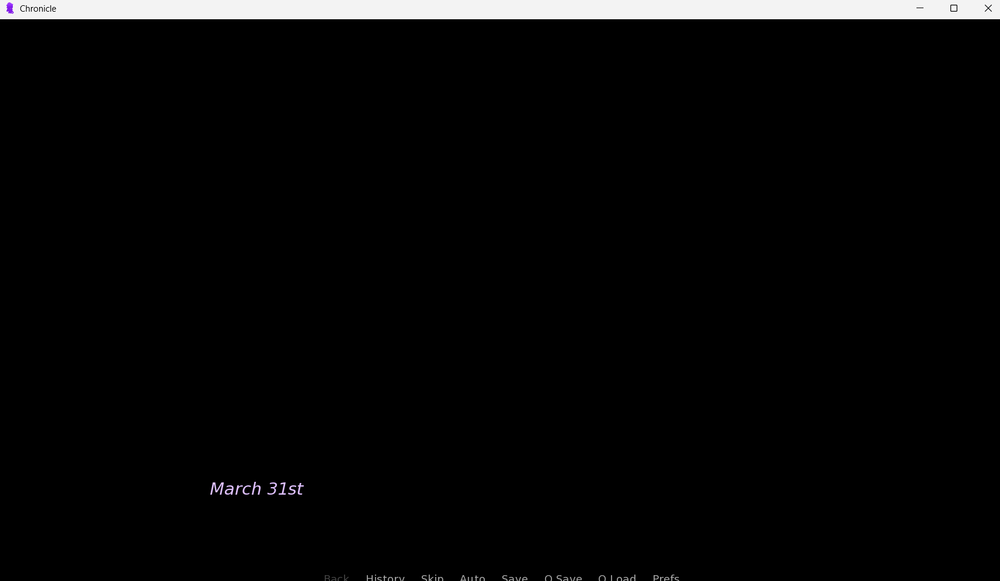
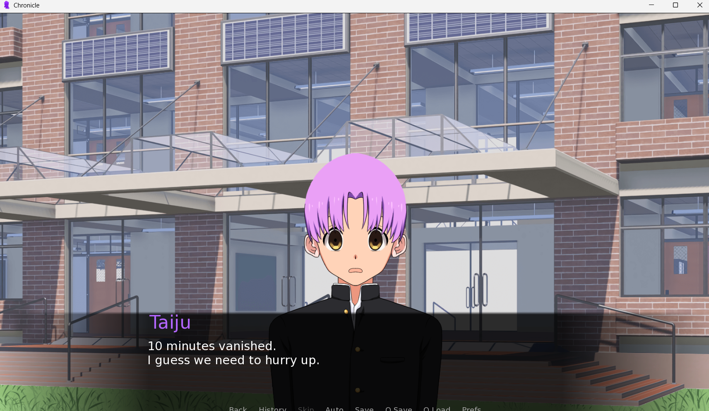
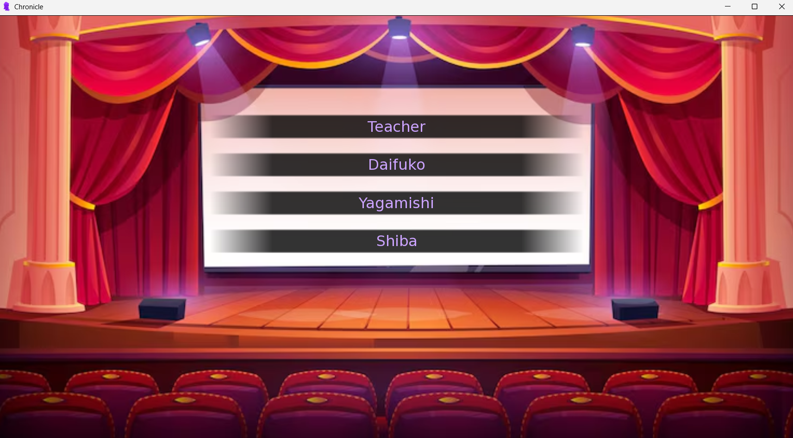

# Chronicle

Chroncile is a visual novel created using Ren'Py and python.The story line is combination of Detective case solving and the last day of school:the Graduation Ceremony.

Chronicle contains three different endings based on how the user solves the case.It takes 30-60 minutes complete the game.

---

## Features

- Detective-style investigation
- Branching logic
- Multiple suspects
- Multiple Endings
- Multiple character expressions

---

## Screenshots







---

## Controls

|Key|Action|
|----|------|
|Left click/space/enter|Next dialogue|
|Ctrl|Skip Read text|
|Esc|Open menu|
|Auto-text|A|
|Hide Text|H|

---
```
## Project Structure
chronicle/
├─ game/
│  ├─ images/
│  ├─ audio/
│  ├─ gui/
│  ├─ script.rpy
│  ├─ options.rpy
│  ├─ gui.rpy
│  └─ screens.rpy
├─ .gitignore
└─ README.md
```
---

## Download

Download from [Itch.io](https:github.com/muin-15/chronicle/releases).

---

## Credits

- Scenes:[Noranekogames](https://noranekogames.itch.io/)
- Scenes:[Itch.io](https://itch.io/queue/c/1958233/classroom-backgrounds?game_id=810438&password=)
- Sprites:[Tainara](https://tainara-p.itch.io/male-character-sprite-creator)
- Audio:[Pixabay](https://pixabay.com/music/search/background%20music/)

---

## License

The project is under the [MIT License](LICENSE)